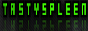

# Quake II Community Github

## General Quake II Links and Resources

* [Quake II on Steam](https://store.steampowered.com/app/2320/Quake_II/)
* [Quake II Legacy](https://quakelegacy.com/)
* [Quake II Remastered Reborn Reunited Discord](https://discord.gg/3udM8Vz)
*  - [Tastyspleen.net Discord](http://discord.tastyspleen.net)
* [Tastyspleen.net](http://tastyspleen.net/)
  
## Mapping Resources

* [Trenchbroom](https://trenchbroom.github.io/)
*  - Map-Center Discord
* ericw-tools | [Windows](https://github.com/ericwa/ericw-tools/releases/tag/2.0.0-alpha1) | [Linux / Mac (build from source)](https://github.com/ericwa/ericw-tools/)

## Source Ports

| - | q2pro | KMQ2 | Yamagi | Q2RTX | Quetoo | r1q2 | APRQ2 |
| --- | :-: | :-: | :-: | :-: | :-: | :-: | :-: |
| Description | Q2PRO is an enhanced, multiplayer oriented Quake 2 client and server. | KMQuake II is an enhanced OpenGL-only Quake II engine with level design oriented enhancements. | Yamagi Quake II is an enhanced client for id Software's Quake II with focus on offline and coop gameplay.| Quake II RTX is NVIDIA's attempt at implementing a fully functional version of Id Software's 1997 hit game Quake II with RTX path-traced global illumination. | Quetoo ("Q2") is a free first person shooter for Mac, PC and Linux. Our goal is to bring the fun of oldschool deathmatch to a new generation of gamers. We're pwning nubz, one rail slug at a time. | Quake II engine mod focused on speed and security. | AprQ2 provides many enhanced features over the regular 3.20 Quake2 Client including: Better graphics, Winamp integration, stainmaps (blood stays on the walls), increased client security, and much more. |
| Main Page | [q2pro](https://skuller.net/q2pro/) | [Knightmare](http://www.markshan.com/knightmare/) | [Yamagi](https://www.yamagi.org/quake2/) | [Getting Started](https://www.nvidia.com/content/dam/en-zz/Solutions/geforce/news/quake-ii-rtx-june-6-release-date/Quake-II-RTX-Getting-Started.pdf) | [Quetoo](http://quetoo.org/) | [r1ch.net](https://r1ch.net/old-stuff) | [Moddb](https://www.moddb.com/games/quake-2/addons/aprq2-v1211-windows-quake2-client)
| Source | :octocat:[Github](https://github.com/skullernet/q2pro) | | :octocat:[Github](https://github.com/yquake2/yquake2) | :octocat:[Github](https://github.com/NVIDIA/Q2RTX) | :octocat:[Github](https://github.com/jdolan/quetoo) | :octocat:[Github](https://github.com/tastyspleen/r1q2-archive) | :octocat:[Github](https://github.com/Shockblast/quake2-aprq2) |
| Links | | | | |  | | | |

## Mods and Mod Resources

### Action Quake II

| Links |
| ---   |
| - [AQ2World Discord](https://discord.aq2world.com)
| - [Forums](https://forums.aq2world.com)
|[AQtion on Steam](https://store.steampowered.com/app/1978800/AQtion/)

### DDay 
| Links |
| --- |
| - [DDay: Normandy Discord](https://discord.gg/Xkpct32)
| - [D-Day Dev Central](http://www.ddaydev.com/site/index.php)
| - [D-Day Archives](http://www.quakewiki.net/archives/dday.planetquake.gamespy.com/site/)
| - [D-Day Francophone](https://ddaynormandy.forumactif.fr/)

### Digital Paintball 2

### MatrixQ2

### Gloom

### Freeze Tag

### Rocket Arena 2

### KOTS (King of the Server)

### Quake 2 Jump/ Q2Jump

* 
* [Stats](http://q2jump.net/)

### Quaketown RPG

### Transformers Q2

### Vortex

## CTF Mods

### Expert CTF

### LFire CTF

### Railwarz CTF

### Weapons Factory CTF

## Weapons Mods

### Chaos

### LOX

### Rampage

### WOD / WODX

